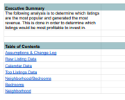
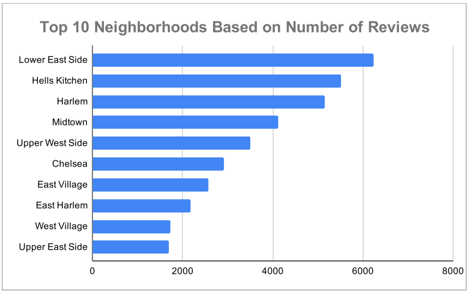
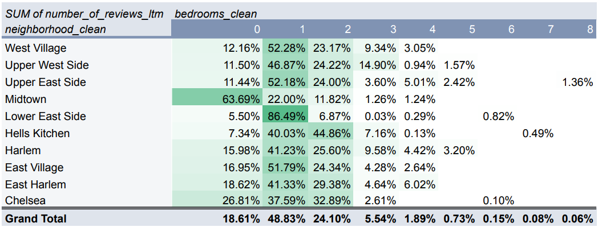

# Spreadsheet Data Analysis: Airbnb Investment Opportunity Analysis

## Project Overview

This project analyzes Airbnb listing and calendar data to identify the most profitable investment opportunities in New York City.

The analysis evaluates listing popularity, revenue potential, neighborhood performance, and bedroom configurations to determine which properties generate the strongest returns for potential investors.

The project was completed using Excel and demonstrates data cleaning, business analysis, pivot table development, and data storytelling techniques.

## Business Problem

Investors need to understand which Airbnb properties generate the highest revenue and what characteristics contribute to stronger performance.

This analysis answers the question:

**Which Airbnb listings represent the best investment opportunities based on popularity and revenue generation?**

## Business Questions

1. Which listings generate the most revenue?

2. Which neighborhoods are the most popular?

3. How does bedroom count impact listing performance?

4. What characteristics define high-performing investment opportunities?

## Tools Used

* Microsoft Excel
* Pivot Tables
* Pivot Charts
* Data Cleaning
* Business Analysis

## Skills Demonstrated

* Data cleaning
* Data validation
* Data transformation
* Pivot table analysis
* Revenue analysis
* Business storytelling
* Data visualization

## Key Findings

* A small group of listings generated disproportionately higher revenue.

* Certain neighborhoods consistently attracted more customer demand.

* Bedroom count influenced overall popularity and booking activity.

* Combining location and property characteristics helps identify stronger investment opportunities.

## Files Included

* Spreadsheet_Data_Analysis_Project.pdf
* screenshots/

* ## Project Preview

### Executive Summary

### Neighborhood Analysis

### Bedroom Analysis

## Project Outcome

This project demonstrates how spreadsheet analysis can be used to transform raw operational data into actionable business recommendations for investment decision-making.
